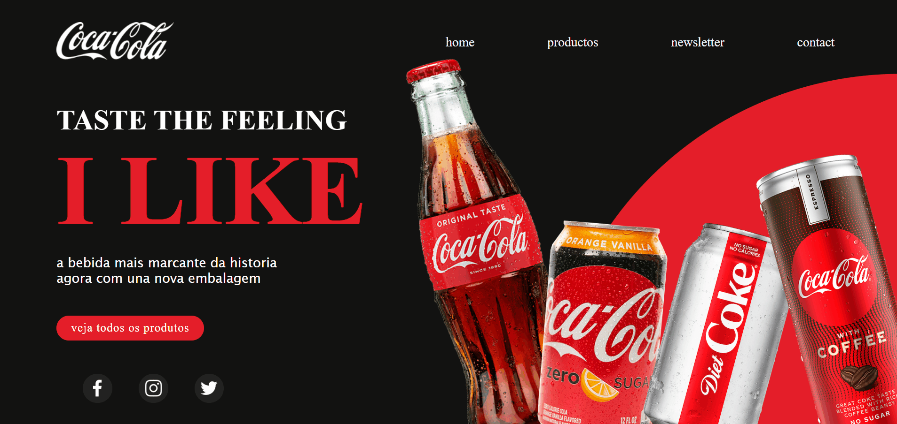
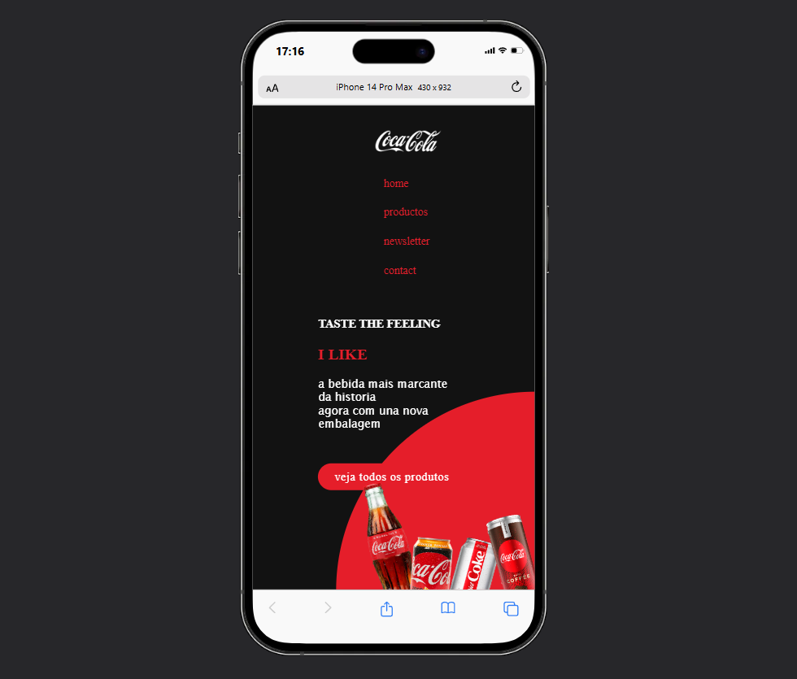

# Projeto
Este projeto é uma landing page inspirada na marca Coca-Cola, desenvolvida com foco em simplicidade e eficiência, utilizando apenas HTML e CSS. O objetivo é recriar a experiência visual de uma página de marca profissional, mantendo o código limpo e sem a necessidade de JavaScript ou frameworks externos.

## Sobre o Projeto
A landing page foi projetada para ser visualmente atraente e responsiva, destacando os elementos característicos da Coca-Cola, como a paleta de cores clássica (vermelho, branco e preto), fontes personalizadas, e imagens de alta qualidade. Este projeto é ideal para praticar e demonstrar habilidades em layout, estilização, e organização de código CSS e HTML.

## Funcionalidades
- Design Responsivo: Layout que se adapta bem a diferentes tamanhos de tela.
- Estética da Marca: Utilização das cores e estilo visual característicos da Coca-Cola.

## Tecnologias Usadas
- HTML
- CSS